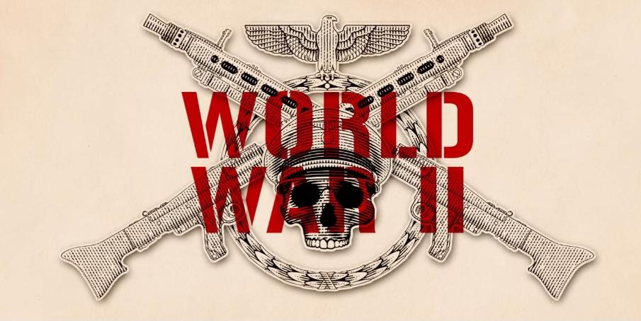
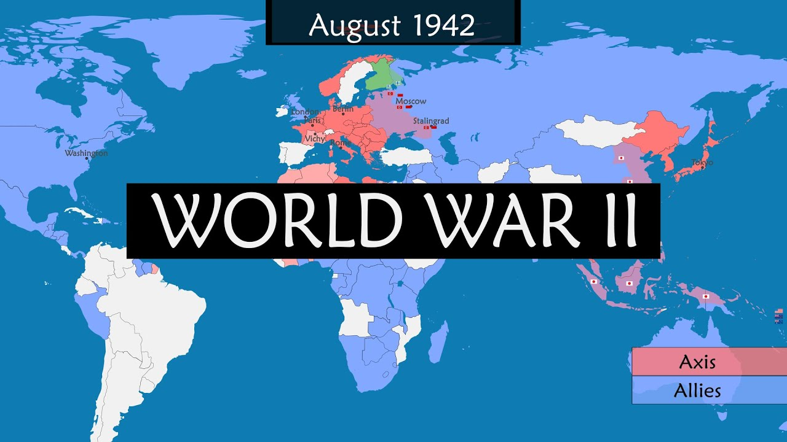
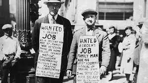
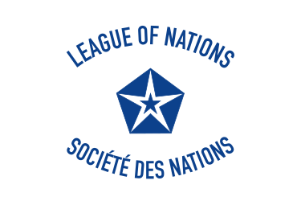

<!DOCTYPE html>
<html lang="en">
<head>
    <meta charset="UTF-8">
    <meta name="viewport" content="width=device-width, initial-scale=1.0">
    <title>웹프로그래밍 과제</title>
     
</head>
<body>
    
202400518 구준서

    <header><h1>제2차 세계대전의 원인과 결과</h1></header>
    
    <nav>
    <h3>목차</h3>
    <ul>
       <li><a href="#a">주제소개</a></li>  
       <li><a href="#b">전쟁의 원인</a></li> 
       <li><a href="#c">전쟁의 결과</a></li> 
       <li><a href="#e">결론</a></li> 
       <li><a href="#f">느낀점</a></li> 
       <li><a href="#g">참고자료</a></li> 
    </ul>
    </nav>

    <section>
        

        <h1>주제소개</h1>
         "제2차 세계 대전(1939-1945)은 20세기 역사에서 가장 치열하고 영향력 있는 전쟁 중 하나로, 전 세계에 걸쳐 막대한 인명 피해와 정치적 변화를 초래했습니다." 
        <h4><li>전쟁의 배경</li></h4>
         이 전쟁은 1차 세계 대전 이후의 불안정한 국제 질서와 경제적 위기, 그리고 파시즘과 나치즘의 부상이라는 복합적인 요인에 의해 촉발되었습니다.   
         특히, 베르사유 조약으로 인한 독일의 불만과 대공황은 세계 여러 나라에서 극단적인 정치 세력이 대두되는 배경이 되었습니다.
        <h4> <li>연구의 목적</li> </h4>
        "본 과제에서는 제2차 세계 대전의 원인과 주요 사건, 그리고 전후 결과를 분석하여 전쟁이 현대 세계에 미친 영향을 탐구하고자 합니다.  
         이를 통해 역사적 사건이 단순한 과거의 일이 아닌, 현재와 미래에도 중요한 교훈을 제공한다는 점을 강조하고 싶습니다."

        <h4><li>논의의 중요성</li></h4>
         제2차 세계 대전은 단순한 군사적 충돌이 아니라 인류의 역사와 사회, 문화에 지대한 영향을 미쳤습니다.  
         따라서 이 전쟁을 이해하는 것은 오늘날의 국제 정치와 사회적 이슈를 분석하는 데 매우 중요합니다.
        

        
 
        <h1>전쟁의 원인</h1>
        
            <h4><li>베르사유 조약</li></h4>
            내용: 제1차 세계 대전 후, 1919년 체결된 베르사유 조약은 독일에게 엄청난 전쟁 배상금과 영토 상실을 부과했습니다. 
            영향: 독일은 조약을 불공정하게 여겼고, 이는 국가 내에서 불만을 일으키며 나치당의 대두를 촉발했습니다.  
            독일 국민들은 패배감과 복수심으로 똘똘 뭉쳤고, 극단적인 민족주의가 부상했습니다.

            <h4><li>경제적 요인</li></h4> 
            대공황: 1929년 시작된 대공황은 전 세계 경제를 황폐화시켰습니다. 많은 국가에서 실업률이 급증하고, 사회 불안이 커졌습니다. 
            극단주의의 대두: 경제적 혼란 속에서 극단적인 정치 세력이 지지를 얻기 시작했습니다.  
            독일, 이탈리아, 일본에서는 파시즘과 군국주의가 부상하면서 전쟁을 정당화하는 이데올로기가 강화되었습니다.
            <h4><li>파시즘과 나치즘의 부상</li></h4>
            이탈리아와 독일: 베니토 무솔리니의 이탈리아와 아돌프 히틀러의 독일은 파시즘과 나치즘을 내세워 권력을 장악했습니다.  
            이들은 제국주의적 팽창을 주장하며 군사적 행동을 정당화했습니다. 
            국내외 정책: 두 정권은 국내 문제를 외부 적으로 돌리며 전쟁을 일으키는 데 집중했습니다.  
            히틀러는 "독일의 Lebensraum(생활 공간)" 확보를 위해 침략적 정책을 추진했습니다.

            <h4><li>국제 정치의 실패</li></h4>
            국제 연맹의 무능력: 전후 국제 질서를 유지하기 위해 설립된 국제 연맹은 주요 강대국인 미국의 불참과 내부 분열로 인해 효과적으로 기능하지 못했습니다. 
            강대국의 침묵: 유럽의 주요 강대국들이 히틀러의 초기 침략을 묵인하며 전쟁의 불씨를 키웠습니다.  
            영국과 프랑스는 평화를 유지하기 위해 "유화 정책"을 시도했지만, 이는 오히려 히틀러의 기세를 더욱 키우는 결과를 초래했습니다.

            <h4><li>제국주의적 팽창</li></h4> 
            일본의 군국주의: 일본은 아시아에서의 팽창을 위해 군사적 행동을 취했습니다.  
            1931년 만주 침공과 1937년 중일 전쟁은 아시아에서의 긴장을 더욱 심화시켰습니다. 
            유럽에서의 팽창: 독일은 체코슬로바키아, 폴란드 등을 차례로 침략하며 전쟁의 확산을 가속화했습니다.
        
 

        

            <h1>전쟁의 결과</h1>
            <h4><li>인명 피해와 난민</li></h4>
            전 세계적으로 약 7000만 명에서 8500만 명의 사망자가 발생했습니다. (이는 군인과 민간인을 포함한 수치입니다.) 
            <h4><li>정치적 변화</li></h4>
            유럽의 재편: 전후 유럽은 주요 강대국의 영향 아래 재편되었습니다. 독일은 동서로 분할되어 동독과 서독으로 나뉘었습니다. 
            냉전의 시작: 미국과 소련 간의 긴장이 고조되며 냉전 시대가 열렸습니다. 이는 국제 정치의 새로운 구도를 형성했습니다.
            <h4><li>국제 기구의 설립</li></h4>
            유엔(UN): 1945년 설립된 유엔은 국제 평화와 안전을 유지하기 위한 기구로, 국가 간의 협력을 증진하는 역할을 맡았습니다. 
            국제 법률 및 전범 재판: 전후 전범 재판이 열리며, 전쟁 범죄에 대한 책임을 물었습니다. 이는 국제법의 발전에 기여했습니다.
        

    </section>

    <article id="e">
        <h1>결론</h1>
        <li>평화의 중요성</li>
        평화는 인간 사회가 발전하고 번영할 수 있는 기본 조건입니다.  
        전쟁은 파괴와 고통만을 낳으며, 평화는 인류의 공동 번영과 행복을 위한 필수적 토대입니다.  제2차 세계 대전의 경험은 평화 유지의 중요성을 명확히 보여주었으며, 
        이를 지키기 위한 국제적 노력이 오늘날에도 계속되어야 한다는 것을 상기시켜줍니다.  
        국제 사회는 대화를 통한 문제 해결과 상호 존중을 통해 지속 가능한 평화를 구축해야 합니다.
    </article>

    <aside id="f">
       <h1>느낀점</h1>
       이번 웹프로그래밍 활동을 통해서 평소에 보던 웹페이지들이 많은 노력과 전문성을 통해 만들어진다는 것을 크게 느꼈고 
       미래 사회에 웹프로그래밍 같은 부분들이 우리 생활에 많은 부분에 크게 작용하며 연결점이 될거같다.
    </aside>
    
    <footer id="g">
        <h4>참고 자료</h4>
        챗 gpt  2차세계대전 관련 정보 사용
    </footer>

</body>
</html>
